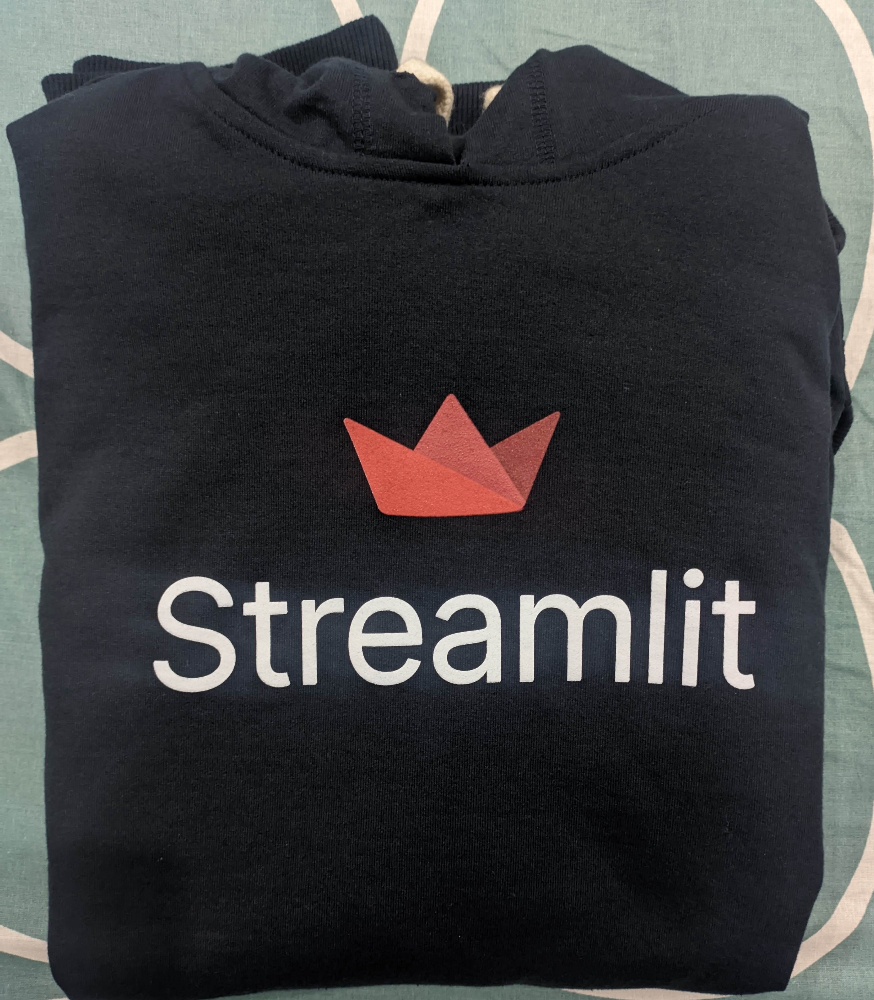
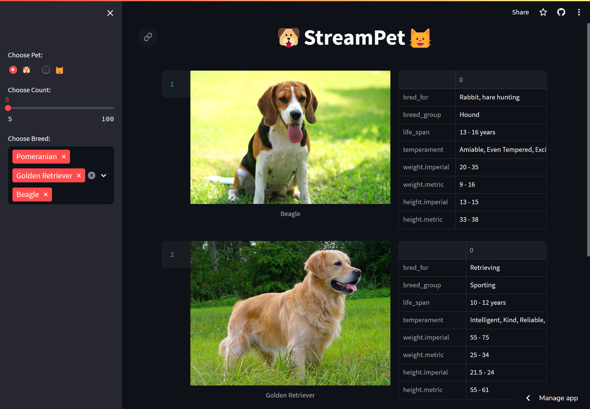
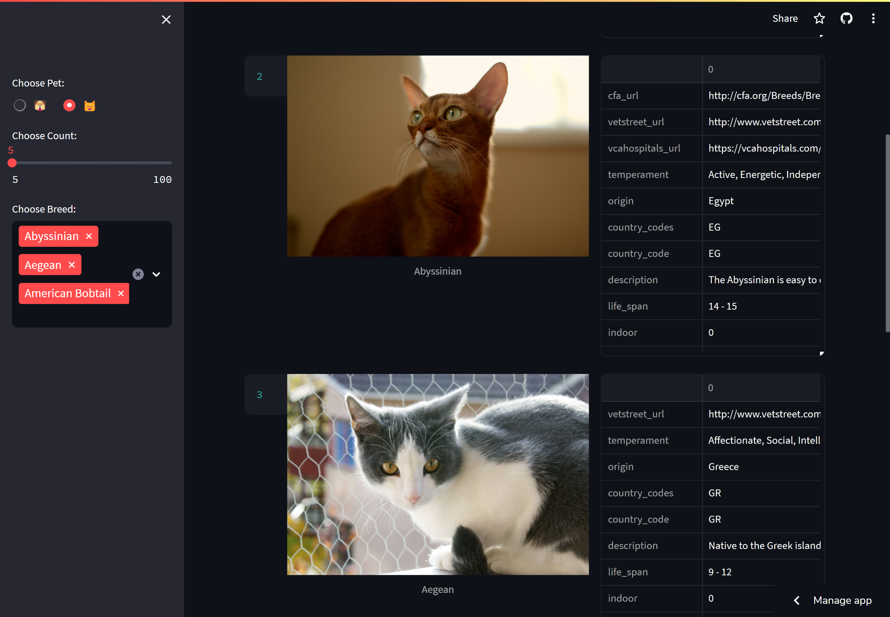

# 🐶StreamPet🐱

[StreamPet](https://streampet.streamlit.app/) is a Streamlit application that allows users to explore images and information of cats and dogs based on their selected preferences.

<details>
  <summary>Swag🧥</summary>
  
  
</details>


## Table of Contents

- [Introduction](#introduction)
- [Installation](#installation)
- [Usage](#usage)
  - [Running the App](#running-the-app)
  - [App Interface](#app-interface)
- [Code Structure](#code-structure)
- [References](#references)

## Introduction

StreamPet is a fun and interactive Streamlit application that connects to cat and dog image APIs to fetch images and information about different cat and dog breeds. Users can choose their preferred pet type, select specific breeds, set the count of images to display, and explore additional details about the selected breeds.




This project was built as part of the [Streamlit Connections Hackathon](https://discuss.streamlit.io/t/connections-hackathon/47574).

The connection to the Dog and Cat API is made using [st.experimental_connection](https://docs.streamlit.io/library/api-reference/connections/st.experimental_connection) as follows:

```python
from connection import StreamPetConnection
conn = st.experimental_connection("StreamPet", type=StreamPetConnection, pet=pet) # pet is either "cat" or "dog"
response = conn.query(url, params=params, ttl=60 * 60) # url is the Cat/Dog API endpoint, params are the parameters to be sent to the API, ttl is data cache ttl
```

st.experimental_connection is used to quickly and easily connect an app to data and APIs.

## Installation

1. Clone the repository to your local machine:

```bash
git clone https://github.com/Prajwalsrinvas/StreamPet.git
cd StreamPet
```

2. Install the required Python packages:

```bash
pip install -r requirements.txt
```

3. Set up your API keys:
   
   - Edit the `secrets.toml` file and add your cat and dog API keys:

   ```toml
   cat_api_key = "your_cat_api_key_here"
   dog_api_key = "your_dog_api_key_here"
   ```

## Usage

### Running the App

Run the StreamPet application by executing the following command in your terminal:

```bash
streamlit run app.py
```

### App Interface

The StreamPet application interface is divided into sections:

- **Pet Selection**: On the left sidebar, you can choose between a cat or a dog using radio buttons.

- **Count Slider**: Set the count of images you want to display using the slider. You can choose between 5 to 100 images.

- **Breed Selection**: Select the specific breeds you are interested in from the multi-select dropdown. By default, the first three breeds are pre-selected.

- **Main Display**: The main section of the app displays the images and details of the selected breeds based on your preferences.


<details>
<summary><h2>Code Structure</h2></summary>

### `app.py`

This script serves as the main entry point for the StreamPet application. It imports necessary libraries, connects to the API, and handles the Streamlit interface.

- `import` Statements:
  - `json`: This module is imported to work with JSON data.
  - `random.shuffle`: The `shuffle` function from the `random` module is used to shuffle the API response images.
  - `pandas as pd`: The `pandas` library is used for data manipulation and analysis.
  - `streamlit as st`: The core library that's used for building the Streamlit application.
  - `StreamPetConnection`: A custom connection class defined in `connection.py`.

- `get_breeds` Function:
  - This function loads the `breeds.json` file and returns the breeds corresponding to the selected pet (cat or dog).

- Main Execution (`if __name__ == "__main__":`):
  - Sets up the Streamlit page configuration, title, and icon.
  - Displays a centered title using Markdown.

- Sidebar UI Elements:
  - Allows users to select between a cat 🐱 or a dog 🐶.
  - A slider to choose the count of images to display.
  - A multi-select dropdown to choose specific breeds.

- Streamlit Connection Setup:
  - Initializes a custom connection to the API using `st.experimental_connection`.
  - Retrieves the API key for the selected pet from `secrets.toml`.

- API Query and Display:
  - Constructs the API URL and parameters.
  - Performs the API query using the custom connection class and caches the response using `@st.cache_data`.
  - Shuffles the API response images.
  - Iterates through the shuffled images and displays them in columns.
  - Displays the breed details using a Pandas DataFrame.

### `connection.py`

This script defines a custom connection class named `StreamPetConnection` that is used to manage API requests and responses.

- `StreamPetConnection` Class (`ExperimentalBaseConnection[requests.Session]`):
  - Inherits from `ExperimentalBaseConnection` and is parameterized with the `requests.Session` type.

- `__init__` Method:
  - Initializes the connection using the provided `connection_name` and any other provided keyword arguments.

- `_connect` Method:
  - Creates and returns a new `requests.Session` object, representing a persistent session to reuse connection resources.

- `cursor` Method:
  - Returns the `_instance` of the connection. In this case, the instance is the `requests.Session` object.

- `query` Method:
  - Takes a URL, parameters, and a TTL (time-to-live) value as inputs.
  - Uses the `st.cache_data` decorator to cache the API response for a specified duration.
  - Performs the API query using the `get` method of the session object and raises an exception if the response status is not OK.
  - Returns the response.

### `breeds.json`

This JSON file contains the list of cat and dog breeds, each associated with an ID and a name. It's used to populate the breed options in the application.

### `secrets.toml`

This configuration file stores the API keys for the cat and dog APIs. It's important to keep this file secure and not share it publicly.

### `requirements.txt`

This file lists the Python packages required for the project. You can use it to create a virtual environment or install the packages directly using `pip`.

</details>


## References

- https://blog.streamlit.io/introducing-st-experimental_connection/
- https://www.youtube.com/watch?v=xQwDfW7UHMo
- https://experimental-connection.streamlit.app/Build_your_own
- https://docs.streamlit.io/library/advanced-features/connecting-to-data
